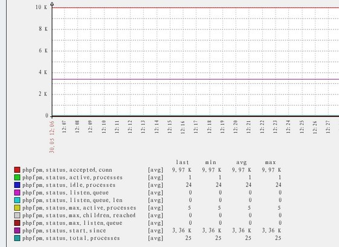

## 基本描述
贡献者: [itnihao](http://weibo.com/itnihao)

## 使用说明
### 前置条件
* 需要确定你有部署php-fpm, 以及你需要监控php-fpm
* PHP-FPM与nginx结合部署

#### php-fpm.conf
文件中存在如下内容:

    pm.status_path = /phpfpmstatus

#### nginx.conf配置

    http{
    ..................
    server {
            listen 127.0.0.1:80;
            server_name 127.0.0.1;
            location ~ ^/(phpfpmstatus)$ {
                 include fastcgi_params;
                 fastcgi_pass unix:/tmp/fpm.sock;
                 #fastcgi_pass 127.0.0.1:9000;
                 fastcgi_param SCRIPT_FILENAME $fastcgi_script_name;
            }
    }
    ................
    }
 

### 部署监控
#### Zabbix Agent
* 将 [scripts/monitor_phpfpm_status](scripts/monitor_phpfpm_status) 文件拷贝至/etc/zabbix/scripts/目录下，并增加执行权限
* 将 [conf/monitor_phpfpm_status.conf](conf/monitor_phpfpm_status.conf) 文件至/etc/zabbix/zabbix_agentd.d/目录下,并重启zabbix agent

#### Zabbix Server
* 导入 [templates/zbx_templates_phpfpm_status.xml](templates/zbx_templates_phpfpm_status.xml) 模板,并关联对应主机
* 效果图:
 

