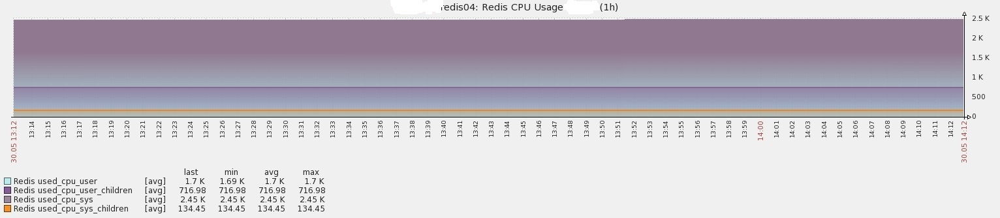
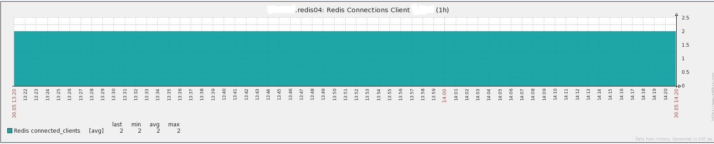
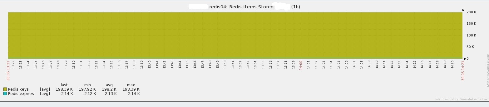
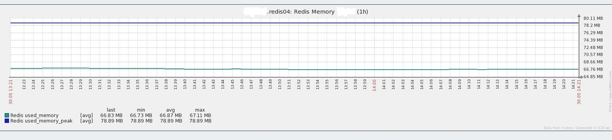
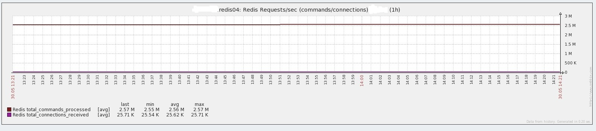

## 基本描述
贡献者: 彬彬 

用于监控[Redis][]

## 使用说明
### 前置条件
* 确保你部署有Redis以及你想通过zabbix监控Redis

### 部署监控
#### Zabbix Agent
* 将[scripts/redis-status.sh](scripts/redis-status.sh)文件拷贝至/etc/zabbix/scripts/目录下,并增加执行权限
* 将[conf/redis.conf](conf/redis.conf)文件拷贝至/etc/zabbix/zabbix_agentd.d/目录下，并重启zabbix agent

#### Zabbix Server
* 导入[templates/redis.xml](templates/redis.xml)模板，并关联对应主机

#### 效果图
* CPU效果图

* 连接效果图

* 已存储的items效果图

* 内存使用效果图 

* 请求状态效果图 

[Redis]: http://redis.io/
